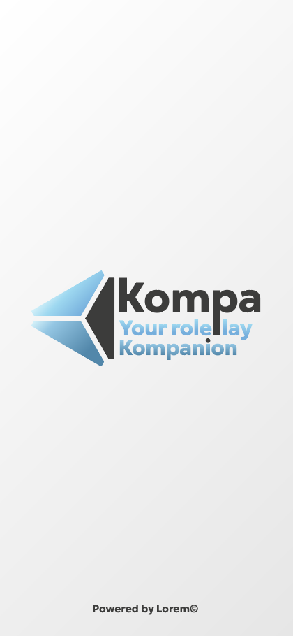

# Kompa - Your roleplay kompanion

The goal of this project is to make an app for role players. This app will replace the old white paper that we have seen in the past. And now we use an app that does exactly the same thing but in better. 

With this app you can play with your friends in real life but you can also keep doing the same behind a screen in your room.

## Functionality

- Login, register to an account
- Add, delete, modify a campaign
- Add, delete, modify a character sheet
- Add, delete, modify accessories, weapons, etc.
- Roll dice and add bonuses automatically
- Every character has his own inventory

## Bonus

- Possibility to play directly on the app with a “board”
- The character can be move on the board with a drag and drop system

